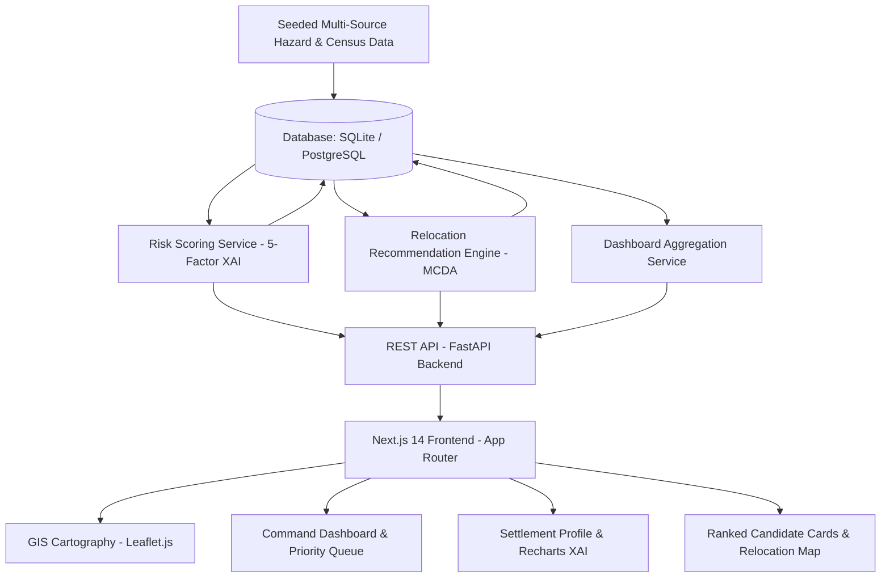

# TerraShield (SIH26191)
## AI-Powered Hazard Risk Intelligence & Relocation Decision Support Platform

> **Problem Statement:** SIH26191 — Intelligent Identification of Hazard-Based Red Zones, Carrying Capacity Assessment, and Immediate Relocation Needs for Vulnerable Habitations  
> **Prepared for:** Smart India Hackathon (SIH 2026)

---

## 🌟 Executive Summary

Disaster-linked displacement affects millions of vulnerable citizens across India every monsoon. Relocation decisions are traditionally made reactively using fragmented data, subjective judgements, and without formal carrying capacity modeling.

**TerraShield** transforms weeks of manual survey into an explainable, data-driven, 3-minute decision workflow:
1. **Explainable Risk Intelligence Engine (XAI):** 5-factor weighted geomorphological model (Slope, Rainfall, Elevation, Density, Historical Incidents) generating an NDMA-auditable score (0–100) and natural-language justifications.
2. **Interactive GIS Red-Zone Cartography:** Full-screen Leaflet geospatial visualization with hazard category color-coding, inundation buffer overlays, and instant habitation inspection drawers.
3. **Carrying-Capacity-Aware Relocation Engine:** Solves the critical *"where do they go?"* challenge using multi-criteria optimization over destination carrying capacity (40%), haversine distance (30%), and road/hospital accessibility (30%).
4. **Executive Decision Command Center:** Role-based personas for District Magistrates, Disaster Management Officers, State Planning Authorities, and NDRF Relief Leads.

---

## 🏛️ Architecture Overview



---

## 📐 Scoring Formulations

### 1. Composite Risk Score (PRD Section 12)
- **Slope (30% weight):** $\text{normalized} = \min(\text{slope\_degrees} / 45.0, 1.0)$
- **Rainfall (25% weight):** $\text{normalized} = \min(\text{recent\_rainfall\_mm} / 400.0, 1.0)$
- **Elevation (15% weight):** $\text{normalized} = 1.0 - \min(\text{elevation\_m} / 100.0, 1.0)$
- **Population Density (15% weight):** $\text{normalized} = \min(\text{density} / 5000.0, 1.0)$
- **Historical Incidents (15% weight):** $\text{normalized} = \min\left(\sum(\text{severity} \times \text{recency}) / 10.0, 1.0\right)$

$$\text{Composite Risk Index} = \sum (\text{Factor Score}) \in [0, 100]$$

| Index Range | Risk Classification | Action Trigger |
|---|---|---|
| **0 – 24.9** | **Safe** | Routine surveillance |
| **25 – 49.9** | **Watch** | Pre-monsoon alert |
| **50 – 74.9** | **Red Zone** | Relocation planning queued |
| **75 – 100** | **Critical Red Zone** | Mandatory immediate evacuation |

### 2. Multi-Criteria Relocation Suitability (PRD Section 13)
- **Carrying Capacity (40%):** $\min(\text{Available Capacity} / \text{Source Population}, 1.0) \times 100$
- **Distance Proximity (30%):** $\max(0, 100 - (\text{Haversine Distance} / \text{Max Radius}) \times 100)$
- **Accessibility & Infrastructure (30%):** Road connectivity + healthcare/school/potable water availability.

$$\text{Recommendation Index} = (C \times 0.4) + (D \times 0.3) + (A \times 0.3)$$

---

## 🚀 Quick Start Guide

### Prerequisites
- Python 3.10+
- Node.js 18+ and npm

### 1. Backend (FastAPI)
```bash
cd backend
python -m pip install -r requirements.txt
python -m uvicorn app.main:app --host 127.0.0.1 --port 8000 --reload
```
- API Documentation: [http://127.0.0.1:8000/docs](http://127.0.0.1:8000/docs)
- Health Check: [http://127.0.0.1:8000/api/health](http://127.0.0.1:8000/api/health)

### 2. Frontend (Next.js 14)
```bash
cd frontend
npm install
npm run dev
```
- Command Center: [http://localhost:3000](http://localhost:3000)

---

## 🗺️ Page Routes

| Route | Purpose |
|---|---|
| `/` | Landing page (product overview, SIH problem statement, live stats) |
| `/login` | Role-based mock authentication (DM / DMO / State Authority / Relief Lead) |
| `/dashboard` | Executive KPI cards, GIS preview, Relocation Priority Queue |
| `/map` | Full-screen GIS Risk Map with layer controls, inundation buffers, and drawer |
| `/settlements` | Filterable and searchable settlements catalog with live re-scoring |
| `/settlements/[id]` | Full settlement profile, XAI factor contribution bar chart, incident timeline |
| `/relocation/[settlementId]` | Ranked candidate relocation sites with carrying capacity bars & approval action |
| `/analytics` | 12-month seasonal trend area chart, cross-district risk breakdown, CSV/PDF export |

---

## 🧪 Automated Tests

Run backend unit and API integration tests:
```bash
cd backend
python tests_backend.py
```
Validates:
- Health check endpoints
- Dashboard aggregations
- Settlement queries
- Rampur Basti verification against PRD Section 12 ground truth (~67.15 score)
- Relocation recommendation scoring & candidate generation
