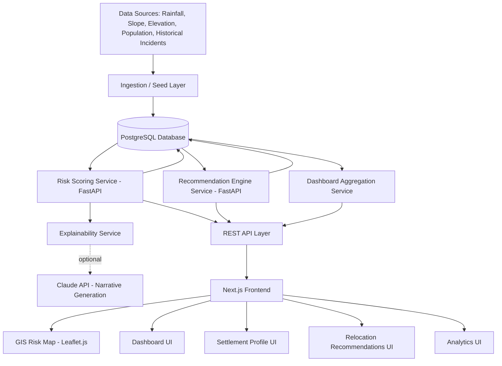
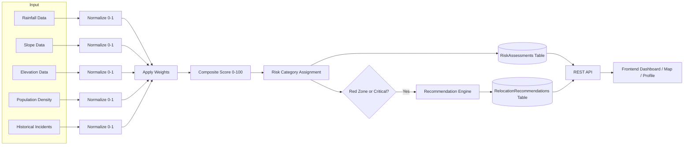

# TerraShield
## AI-Powered Hazard Risk Intelligence and Relocation Decision Support Platform
### Product Requirements Document (PRD)

**Problem Statement:** SIH26191 — Intelligent Identification of Hazard-Based Red Zones, Carrying Capacity Assessment, and Immediate Relocation Needs for Vulnerable Habitations
**Prepared for:** Smart India Hackathon 2026
**Document Type:** Implementation-Ready PRD (suitable for AI coding tools: Claude Code, Cursor, Lovable, Antigravity, Bolt, Replit, v0)
**Version:** 1.0

---

## Table of Contents

1. Executive Summary
2. Problem Analysis
3. User Personas
4. Product Vision
5. Product Objectives
6. Functional Requirements
7. Non-Functional Requirements
8. User Flow Diagrams
9. Information Architecture
10. Feature Prioritization
11. AI/ML Architecture
12. Risk Scoring Framework
13. Relocation Recommendation Engine
14. GIS System Architecture
15. Database Design
16. API Design
17. Frontend Architecture
18. Backend Architecture
19. Dashboard Screen Specifications
20. Wireframe Descriptions
21. System Architecture Diagram
22. Data Flow Diagram
23. MVP Scope (6-Hour Hackathon)
24. Future Scope
25. Risk Analysis
26. SIH Winning Strategy
27. Demo Narrative
28. Judge Q&A Preparation

---

## 1. Executive Summary

### The Problem

India has thousands of habitations sited in hazard-prone terrain — floodplains, landslide-prone hill slopes, cyclone-exposed coastlines, seismic fault zones, and low-lying urban clusters. Every monsoon and every disaster cycle, district administrations are forced to make life-and-death decisions about which settlements are unsafe, how many people need to move, and where they should go — usually with outdated maps, fragmented data, and no standardized methodology. Relocation decisions are made reactively, after a disaster has already occurred, rather than proactively, before lives are lost.

### Current Challenges

- Hazard data (rainfall, slope, elevation, seismic zones, historical incident records) exists in disconnected silos across the Survey of India, IMD, State Disaster Management Authorities (SDMAs), NDMA, and local Revenue Departments.
- Risk classification of settlements is done manually by field officers using paper surveys and personal judgement, with no consistent scoring methodology across districts or states.
- There is no systematic way to calculate the "carrying capacity" of a proposed relocation site — administrators often relocate people into sites that are themselves unsafe, overcrowded, or inaccessible.
- Relocation prioritization (who moves first) is rarely data-driven, and vulnerable groups (elderly, disabled, single-parent households) are often not weighted appropriately.
- Decision-makers lack a single-pane-of-glass view combining hazard maps, population data, and settlement-level risk in one place.

### Why This Matters

Disaster-linked displacement in India affects millions of people annually. A delay of even a few weeks in identifying a red-zone settlement can be the difference between an orderly relocation and a fatal disaster response. A platform that turns fragmented geospatial and demographic data into a clear, explainable, prioritized action list for administrators has direct, measurable life-safety impact — this is the core promise of TerraShield.

### Proposed Solution

**TerraShield** is an AI-powered decision-support platform that:

1. Ingests multi-source hazard and demographic data (rainfall, slope, elevation, population density, historical hazard incidents).
2. Runs each settlement through an **explainable AI risk-scoring engine** that classifies it into a hazard category (Safe / Watch / Red Zone / Critical Red Zone).
3. Visualizes results on an **interactive GIS heatmap** with layered hazard overlays.
4. Automatically computes the **carrying capacity** of candidate relocation sites and recommends the best-fit safe location using a multi-factor scoring model (distance, capacity, accessibility, safety).
5. Generates a **prioritized relocation action list** for District Magistrates and Disaster Management Officers, with full explainability of *why* each settlement was flagged.
6. Provides an **analytics dashboard** for state-level planning, trend monitoring, and report generation.

TerraShield turns weeks of manual survey and judgement calls into a data-driven workflow that can be run in minutes, with full auditability for government decision-making.

---

## 2. Problem Analysis

### Existing Gaps

| Gap | Description |
|---|---|
| Data fragmentation | Rainfall data (IMD), elevation/slope (Survey of India DEM), population (Census/SECC), and hazard history (SDMA records) live in separate systems with no unified schema. |
| No standardized scoring | Each district uses its own informal criteria for what counts as a "red zone," making state-level comparison impossible. |
| No carrying-capacity modeling | Relocation sites are chosen based on land availability alone, not on whether the site can safely and sustainably support the incoming population. |
| Reactive, not proactive | Risk assessments typically happen after a disaster (post-hoc damage assessment) rather than continuously, ahead of the monsoon/hazard season. |
| No explainability | Even where scoring exists, officers cannot audit or explain *why* a settlement was classified as high-risk, which undermines trust and legal defensibility of relocation orders. |
| No prioritization logic | When multiple settlements are flagged, there's no systematic way to decide which to relocate first given limited government resources (funds, transport, temporary housing). |

### Government Challenges

- **Budget-constrained relief operations**: Relocation and rehabilitation budgets are finite; administrators need to know precisely where the money will save the most lives.
- **Inter-departmental coordination**: Revenue, Disaster Management, Rural Development, and Urban Local Bodies all hold pieces of the puzzle but rarely share a common data platform.
- **Legal and political accountability**: Relocation orders affect land rights and livelihoods; decisions must be defensible with clear, auditable evidence.
- **Time pressure**: Pre-monsoon and pre-cyclone windows are short; manual field surveys of thousands of settlements cannot be completed in time.

### Manual Risk Assessment Limitations

- Field surveys are slow, subjective, and inconsistently documented.
- Historical hazard data (past flood/landslide incidents) is rarely digitized or cross-referenced against current settlement footprints.
- There is no mechanism to re-run risk assessments quickly as new rainfall/weather data arrives.

### Relocation Planning Issues

- Alternative sites are often chosen without formal capacity or accessibility analysis (distance to roads, hospitals, schools, water sources).
- No standardized way to check whether a "safe" relocation site is itself hazard-free.
- Vulnerable population segments (elderly, disabled, women-headed households, children) are not consistently prioritized in relocation queues.

---

## 3. User Personas

### 3.1 District Magistrate (DM)

- **Goals**: Get a single, trustworthy view of which settlements in the district are at risk; make legally defensible relocation decisions quickly; allocate limited relief budget to maximum effect.
- **Frustrations**: Receives fragmented reports from multiple departments; no way to independently verify field officers' risk claims; under political and legal pressure to justify every relocation order.
- **Expected Benefits**: One dashboard showing district-wide red zones, population at risk, and a prioritized, explainable action list ready to sign off on.

### 3.2 Disaster Management Officer (DMO)

- **Goals**: Continuously monitor hazard indicators (rainfall, slope stability, historical incident trends) for all settlements under their jurisdiction; flag emerging red zones before disaster strikes.
- **Frustrations**: Manually cross-referencing IMD bulletins, DEM maps, and paper survey forms; no automated alerting when a settlement crosses a risk threshold.
- **Expected Benefits**: Automated risk scoring and alerting, GIS visualization, and settlement-level drill-down with historical incident overlays.

### 3.3 State Planning Authority

- **Goals**: Plan long-term rehabilitation infrastructure, allocate state disaster-relief funds across districts, track relocation program performance over time.
- **Frustrations**: No state-wide aggregated analytics; district-level data arrives in inconsistent formats and timelines; hard to compare risk trends across districts.
- **Expected Benefits**: State-wide analytics dashboard with trend charts, cross-district comparisons, and exportable reports for budget planning.

### 3.4 Relief & Rehabilitation Team

- **Goals**: Execute the physical relocation — identify a safe, accessible site with sufficient capacity; sequence which households move first; coordinate transport and temporary shelter.
- **Frustrations**: No systematic way to evaluate candidate relocation sites; last-minute scrambles to find sites that turn out to be inadequate (overcrowded, inaccessible, or themselves hazardous).
- **Expected Benefits**: Ranked list of recommended relocation sites with capacity, distance, and accessibility scores; prioritized household relocation sequencing.

---

## 4. Product Vision

### Mission

To give every district administration in India a single, explainable, AI-powered command center for identifying at-risk settlements and executing safe, data-driven relocations — before disaster strikes, not after.

### Long-Term Vision

TerraShield becomes the national standard decision-support layer sitting between raw hazard data (satellite, IMD, DEM, IoT sensors) and human decision-makers (DMs, SDMAs, NDMA), continuously scoring every habitation in the country and maintaining a living, auditable registry of red zones and relocation plans.

### Expected Impact

- Reduction in disaster-linked casualties through earlier identification of red-zone settlements.
- Faster, more defensible relocation decisions with full audit trails.
- More efficient use of relief and rehabilitation budgets by directing resources to highest-priority settlements first.
- A reusable data backbone that any state government can deploy on top of their existing GIS and census infrastructure.

---

## 5. Product Objectives

### Business Objectives

- Deliver a deployable MVP that a state government pilot could adopt within one disaster season.
- Build a modular, API-first architecture that can be integrated with existing e-Governance and GIS systems (e.g., Bhuvan, SDMA portals).

### Social Objectives

- Directly reduce loss of life and property from predictable, slow-onset hazards (floods, landslides).
- Ensure equitable prioritization of vulnerable populations in relocation planning.
- Increase transparency and public trust in government relocation decisions through explainable AI.

### Operational Objectives

- Cut settlement risk-assessment turnaround from weeks (manual survey) to minutes (automated scoring).
- Provide a single source of truth for hazard, population, and relocation data across departments.
- Enable continuous re-scoring as new hazard data (rainfall, seismic activity) arrives.

---

## 6. Functional Requirements

### 6.1 Dashboard

- Display **total population at risk** (aggregated across all red-zone settlements).
- Display **total settlements monitored**, broken down by risk category (Safe / Watch / Red Zone / Critical).
- Display **count and map preview of red zones** in the selected district/state.
- Display a **prioritized relocation queue** — top N settlements ranked by urgency score.
- Filterable by district, hazard type (flood/landslide/cyclone/seismic), and risk category.

### 6.2 Risk Intelligence Engine

- Compute a **composite risk score (0–100)** per settlement from input variables (rainfall, slope, elevation, population density, historical hazard incidents).
- Classify each settlement into a **risk category**: Safe, Watch, Red Zone, Critical Red Zone.
- Provide an **explainability breakdown** showing each factor's contribution to the final score (e.g., "Slope contributed 32 points due to >30° gradient").
- Support **on-demand re-scoring** when new hazard data is ingested.

### 6.3 GIS Risk Map

- Interactive map with a **heatmap layer** showing risk intensity across the district/state.
- **Layer controls** to toggle rainfall, slope, elevation, flood-plain boundaries, and historical incident markers on/off.
- Click-to-drill-down: clicking a settlement marker opens its full risk profile.
- Color-coded markers by risk category (green/yellow/orange/red).

### 6.4 Settlement Analysis

- **Settlement profile page**: name, location, population, households, risk score, risk category, contributing risk factors.
- **Risk factor breakdown**: chart showing weighted contribution of each input variable.
- **Historical incidents**: timeline of past hazard events affecting the settlement (floods, landslides, cyclones) with dates and severity.

### 6.5 Relocation Recommendation Engine

- For any red-zone settlement, generate a **ranked list of candidate alternative safe locations**.
- Each candidate scored on: **carrying capacity** (can it absorb the incoming population), **distance** from the origin settlement, and **accessibility** (road connectivity, distance to hospital/school/water source).
- Composite **recommendation score** combining the above factors, with the top recommendation highlighted.

### 6.6 Analytics Dashboard

- **Trend charts**: risk score evolution over time per district, seasonal hazard patterns.
- **Reports**: exportable (PDF/CSV) summary reports for DM/state-level review.
- **Administrative insights**: cross-district comparison of red-zone counts, population at risk, and relocation progress.

---

## 7. Non-Functional Requirements

| Category | Requirement |
|---|---|
| **Security** | Role-based access control (DM, DMO, State Authority, Relief Team); encrypted data at rest and in transit; audit logging of all relocation-decision actions. |
| **Performance** | Dashboard and map views load within 2–3 seconds for a district-scale dataset (hundreds of settlements); risk re-scoring completes within seconds per settlement. |
| **Scalability** | Backend architecture supports horizontal scaling to state-wide (thousands of settlements) and eventually national-scale datasets. |
| **Reliability** | Core scoring and recommendation services designed to degrade gracefully (e.g., serve last-known-good scores if a live data feed is unavailable). |
| **Accessibility** | UI complies with WCAG 2.1 AA where feasible (color-blind-safe risk-category palette, keyboard navigation, readable font sizes) given the low-bandwidth, varied-literacy field-officer user base. |

---

## 8. User Flow Diagrams

### 8.1 Risk Assessment Flow

1. DMO logs in → selects district → Dashboard loads with current risk summary.
2. DMO opens **Risk Intelligence Engine** → selects a settlement (or "re-score all").
3. Engine pulls latest rainfall/slope/elevation/population/historical data → computes composite score → assigns risk category.
4. DMO views explainability breakdown → confirms or flags for field verification.
5. Settlement's status updates on Dashboard and GIS map in real time.

### 8.2 Zone Identification Flow

1. DM opens **GIS Risk Map** → toggles hazard layers (e.g., flood-plain + rainfall).
2. Heatmap renders risk intensity across the district.
3. DM clicks a high-intensity cluster → drills into settlement-level list within that zone.
4. DM marks the cluster as a confirmed **Red Zone** pending relocation planning.

### 8.3 Relocation Planning Flow

1. Relief & Rehabilitation Team opens a confirmed red-zone settlement's profile.
2. Team triggers **Relocation Recommendation Engine** → engine evaluates candidate sites within a configurable radius.
3. Engine returns ranked recommendations with capacity, distance, and accessibility scores.
4. Team selects a site → generates a relocation plan record → DM reviews and approves.
5. Plan status is tracked on the Analytics Dashboard (planned → in-progress → completed).

---

## 9. Information Architecture

### Navigation Structure

```
TerraShield
├── Landing Page (public overview / login)
├── Dashboard (home after login)
│   ├── Risk Summary Cards
│   ├── Relocation Priority Queue
│   └── Quick Map Preview
├── Risk Map (GIS)
│   ├── Heatmap + Layer Controls
│   └── Settlement Markers → Settlement Profile
├── Settlements
│   ├── Settlement List (searchable/filterable)
│   └── Settlement Profile Detail
│       ├── Risk Breakdown
│       ├── Historical Incidents
│       └── Relocation Recommendations
├── Relocation
│   ├── Recommendation Engine Results
│   └── Relocation Plan Tracker
├── Analytics
│   ├── Trends
│   ├── Cross-District Comparison
│   └── Report Export
└── Admin
    ├── User & Role Management
    └── Data Source Management
```

### Modules & Relationships

- **Settlement** is the central entity; it has one-to-many **HazardData** points, one **RiskAssessment** (latest), and zero-or-more **RelocationRecommendations**.
- **RiskAssessment** references the Settlement and the HazardData snapshot used to compute it (auditability).
- **RelocationRecommendation** links a source Settlement to a candidate destination location with computed scores.
- **Users** are scoped by role and district/state jurisdiction.

---

## 10. Feature Prioritization

### Must Have (MVP-critical)
- Dashboard with risk summary cards
- Risk Intelligence Engine (scoring + classification)
- GIS Risk Map with heatmap
- Settlement Profile with explainability
- Relocation Recommendation Engine (basic scoring)

### Should Have
- Historical incident timeline per settlement
- Analytics trend charts
- Report export (PDF/CSV)
- Role-based access control

### Could Have
- Multi-language UI (Hindi + regional languages)
- Mobile-responsive field-officer view
- Notification/alerting on threshold breach

### Future Scope
- Satellite imagery integration
- IoT sensor feeds (real-time slope/water-level sensors)
- Real-time weather API integration
- Predictive evacuation route planning
- Mobile app for field data collection

---

## 11. AI/ML Architecture

### Input Variables

| Variable | Source (real-world) | MVP Source |
|---|---|---|
| Rainfall (mm, recent + historical avg) | IMD | CSV/synthetic dataset |
| Slope (degrees) | Survey of India DEM | Precomputed per settlement |
| Elevation (meters) | DEM | Precomputed per settlement |
| Population density (people/km²) | Census/SECC | Settlement table |
| Historical hazard incidents (count, severity, recency) | SDMA records | Seeded incident table |

### Output

- **Risk Score**: continuous value, 0–100.
- **Risk Category**: Safe (0–24) / Watch (25–49) / Red Zone (50–74) / Critical Red Zone (75–100).
- **Relocation Priority**: derived rank combining risk score with population and vulnerability weighting.

### Data Flow

1. Raw hazard + demographic inputs are ingested/seeded into the `HazardData` table, keyed by `settlement_id`.
2. The **Risk Scoring Service** (Python/FastAPI) pulls the latest `HazardData` row per settlement.
3. Each input is normalized to a 0–1 scale, multiplied by its weight (see Section 12), and summed into a raw score, then scaled to 0–100.
4. The score is written to `RiskAssessments` along with a JSON breakdown of each factor's contribution (for explainability).
5. The GIS layer and Dashboard read from `RiskAssessments` for display.

### Training Approach (MVP-realistic)

For a 6-hour hackathon, a full ML model with historical labeled outcomes is not feasible or necessary — and a **transparent, weighted rule-based scoring model is the right choice for a government-facing, explainability-critical use case** in any case. The MVP should present this as an **explainable AI (XAI) scoring engine**: a formula-driven model whose weights can be described as having been derived from disaster-management domain literature (NDMA guidelines, flood/landslide risk indices) and are tunable per-hazard-type. This is honest, defensible, and still demonstrably "AI-powered" via the explainability layer, natural-language justification generation, and the recommendation engine's multi-criteria optimization.

Where a genuine ML component adds value with low risk in the demo window: a **lightweight classifier (e.g., logistic regression or decision tree) trained on a small synthetic labeled dataset** (settlements labeled Safe/Watch/Red/Critical based on the same weighted formula, with noise added) can be trained in minutes using scikit-learn, and used to show a live "model confidence" score alongside the rule-based score — giving a genuine ML artifact without requiring real historical ground-truth data that doesn't exist in the hackathon timeframe.

### Model Selection

- **Primary**: Weighted multi-criteria scoring formula (transparent, explainable, defensible — see Section 12).
- **Secondary (optional, if time permits)**: scikit-learn `DecisionTreeClassifier` or `LogisticRegression` trained on synthetic data derived from the same formula, used to demonstrate a genuine trained-model artifact and feature-importance chart.
- **Recommendation Engine**: multi-criteria decision analysis (weighted sum model) over capacity, distance, and accessibility — not a "black box," so it stays explainable and fast.

### Explainability Layer

- Every risk score is stored with a **factor-contribution breakdown** (JSON: `{factor, raw_value, normalized_value, weight, points_contributed}`).
- The UI renders this as a horizontal bar chart ("Slope: 32/40 pts", "Rainfall: 18/25 pts", etc.) on the Settlement Profile page.
- A short **natural-language justification** is generated from the breakdown (e.g., "This settlement is classified Red Zone primarily due to steep slope (34°) and high recent rainfall (312mm), consistent with 3 historical landslide incidents in the past 5 years.") — this can be templated (no LLM call required) or generated via a call to the Claude API for a more natural narrative, which doubles as a visible "AI-powered" touchpoint for judges.

---

## 12. Risk Scoring Framework

### Weightage Model

| Factor | Weight | Rationale |
|---|---|---|
| Slope | 30% | Primary driver of landslide risk |
| Rainfall (recent + historical intensity) | 25% | Primary driver of flood risk |
| Elevation (relative to flood-plain/sea level) | 15% | Compounds flood exposure |
| Population Density | 15% | Determines consequence severity, not just hazard likelihood |
| Historical Hazard Incidents (frequency + recency + severity) | 15% | Empirical validation of hazard exposure |

### Calculation Logic

For each factor, normalize the raw value to a 0–1 scale using a domain-informed threshold, then compute:

```
Factor Score = Normalized Value × Weight × 100
Composite Risk Score = Σ (Factor Scores)   [0–100]
```

**Normalization examples:**
- Slope: `normalized = min(slope_degrees / 45, 1.0)` (45° treated as maximum severity)
- Rainfall: `normalized = min(recent_rainfall_mm / 400, 1.0)` (400mm treated as extreme)
- Elevation: `normalized = 1 - min(elevation_m / 100, 1.0)` (lower elevation = higher risk, capped at 100m)
- Population density: `normalized = min(density / 5000, 1.0)` (5000/km² treated as very high)
- Historical incidents: `normalized = min((incident_count × recency_factor × avg_severity) / 10, 1.0)`

**Risk Category thresholds:**
- 0–24 → Safe
- 25–49 → Watch
- 50–74 → Red Zone
- 75–100 → Critical Red Zone

### Example Calculation

Settlement "Rampur Basti" — Slope: 36°, Recent rainfall: 280mm, Elevation: 12m, Population density: 3200/km², Historical incidents: 3 floods in last 5 years (avg severity 0.7, recency factor 0.9).

| Factor | Raw | Normalized | Weight | Points |
|---|---|---|---|---|
| Slope | 36° | 0.80 | 30% | 24.0 |
| Rainfall | 280mm | 0.70 | 25% | 17.5 |
| Elevation | 12m | 0.88 | 15% | 13.2 |
| Population density | 3200/km² | 0.64 | 15% | 9.6 |
| Historical incidents | 3×0.9×0.7=1.89→/10 | 0.19 | 15% | 2.85 |
| **Composite Score** | | | | **67.15 → Red Zone** |

---

## 13. Relocation Recommendation Engine

### Decision Logic

For a given red-zone settlement, the engine:

1. Queries all candidate relocation sites within a configurable radius (e.g., 25km) that are themselves classified Safe or Watch.
2. Scores each candidate on three weighted dimensions and produces a composite **Recommendation Score (0–100)**.
3. Returns the top-N candidates ranked by score, with a breakdown per dimension.

### Capacity Evaluation

```
Available Capacity = Site Land Area (usable, km²) × Safe Habitation Density Threshold − Existing Population
Capacity Score = min(Available Capacity / Population to Relocate, 1.0) × 100
```

A site with insufficient capacity to absorb the at-risk population is either excluded or flagged as requiring phased relocation.

### Distance Scoring

```
Distance Score = max(0, 100 − (distance_km / max_radius_km) × 100)
```
Closer sites score higher (minimizes displacement disruption to livelihoods, schooling, social ties), but are excluded entirely if within a hazard buffer zone.

### Accessibility Scoring

```
Accessibility Score = weighted average of:
  - Road connectivity (binary/graded: paved road within 2km)
  - Distance to nearest hospital
  - Distance to nearest school
  - Distance to potable water source
```
Each sub-factor normalized 0–100 and averaged (equal weight by default, configurable).

### Composite Recommendation Score

```
Recommendation Score = (Capacity Score × 0.4) + (Distance Score × 0.3) + (Accessibility Score × 0.3)
```

The top-ranked candidate is highlighted as the "Recommended Site," with the full breakdown shown for the Relief & Rehabilitation Team's review and DM sign-off.

---

## 14. GIS System Architecture

### Data Layers

- **Base layer**: OpenStreetMap / satellite tile layer.
- **Hazard layers**: flood-plain boundary polygons, slope-gradient overlay, rainfall intensity heatmap.
- **Settlement layer**: point markers color-coded by risk category.
- **Historical incident layer**: markers/icons for past disaster events with severity indicators.
- **Relocation layer**: candidate and confirmed relocation site markers with capacity indicators.

### Mapping Engine

- **MVP**: Leaflet.js (lightweight, fast to implement, good heatmap plugin support via `leaflet.heat`) or Mapbox GL JS if a token is available for richer 3D terrain rendering.
- Tile source: OpenStreetMap (free, no API key required) for hackathon reliability.

### Visualization Approach

- Heatmap layer computed client-side from settlement risk scores (weighted by population) using `leaflet.heat`.
- Layer-toggle control panel (checkbox list) in the top-right corner.
- Marker clustering (`leaflet.markercluster`) for performance at scale.
- Click interactions trigger a side-panel (not a full page navigation) showing settlement summary, with a "View Full Profile" link.

---

## 15. Database Design

### Schema Overview (PostgreSQL)

**Table: Users**
| Field | Type | Notes |
|---|---|---|
| id | UUID PK | |
| name | VARCHAR | |
| email | VARCHAR UNIQUE | |
| password_hash | VARCHAR | |
| role | ENUM('dm','dmo','state_authority','relief_team','admin') | |
| jurisdiction_district | VARCHAR | nullable for state-level roles |
| jurisdiction_state | VARCHAR | |
| created_at | TIMESTAMP | |

**Table: Settlements**
| Field | Type | Notes |
|---|---|---|
| id | UUID PK | |
| name | VARCHAR | |
| district | VARCHAR | |
| state | VARCHAR | |
| latitude | FLOAT | |
| longitude | FLOAT | |
| population | INT | |
| households | INT | |
| land_area_km2 | FLOAT | |
| created_at | TIMESTAMP | |

**Table: HazardData**
| Field | Type | Notes |
|---|---|---|
| id | UUID PK | |
| settlement_id | UUID FK → Settlements.id | |
| rainfall_mm | FLOAT | most recent reading |
| slope_degrees | FLOAT | |
| elevation_m | FLOAT | |
| population_density | FLOAT | derived or supplied |
| recorded_at | TIMESTAMP | |

**Table: HistoricalIncidents**
| Field | Type | Notes |
|---|---|---|
| id | UUID PK | |
| settlement_id | UUID FK → Settlements.id | |
| hazard_type | ENUM('flood','landslide','cyclone','earthquake') | |
| severity | FLOAT (0–1) | |
| incident_date | DATE | |

**Table: RiskAssessments**
| Field | Type | Notes |
|---|---|---|
| id | UUID PK | |
| settlement_id | UUID FK → Settlements.id | |
| hazard_data_id | UUID FK → HazardData.id | snapshot used |
| risk_score | FLOAT | 0–100 |
| risk_category | ENUM('safe','watch','red_zone','critical') | |
| factor_breakdown | JSONB | explainability payload |
| assessed_at | TIMESTAMP | |

**Table: RelocationRecommendations**
| Field | Type | Notes |
|---|---|---|
| id | UUID PK | |
| source_settlement_id | UUID FK → Settlements.id | |
| candidate_latitude | FLOAT | |
| candidate_longitude | FLOAT | |
| candidate_name | VARCHAR | |
| capacity_score | FLOAT | |
| distance_score | FLOAT | |
| accessibility_score | FLOAT | |
| recommendation_score | FLOAT | |
| status | ENUM('proposed','approved','in_progress','completed') | |
| created_at | TIMESTAMP | |

### Relationships

- `Settlements` 1—* `HazardData`
- `Settlements` 1—* `HistoricalIncidents`
- `Settlements` 1—* `RiskAssessments`
- `Settlements` 1—* `RelocationRecommendations` (as source)
- `Users` scoped to `district`/`state` for row-level access filtering at the API layer.

---

## 16. API Design

Base URL: `/api/v1`

### Settlements

**GET /api/settlements** — list settlements, filterable by `district`, `risk_category`.
```json
Response 200:
{
  "count": 128,
  "results": [
    {
      "id": "uuid",
      "name": "Rampur Basti",
      "district": "Bahraich",
      "latitude": 27.57,
      "longitude": 81.59,
      "population": 2100,
      "risk_category": "red_zone",
      "risk_score": 67.15
    }
  ]
}
```

**GET /api/settlements/{id}** — full settlement profile including latest risk assessment and historical incidents.

**POST /api/settlements** — create a new settlement record.
```json
Request:
{
  "name": "Rampur Basti",
  "district": "Bahraich",
  "state": "Uttar Pradesh",
  "latitude": 27.57,
  "longitude": 81.59,
  "population": 2100,
  "households": 410,
  "land_area_km2": 1.2
}
```

### Risk

**GET /api/risk/{settlement_id}** — returns the latest risk assessment with factor breakdown.
```json
Response 200:
{
  "settlement_id": "uuid",
  "risk_score": 67.15,
  "risk_category": "red_zone",
  "factor_breakdown": [
    {"factor": "slope", "raw_value": 36, "normalized": 0.80, "weight": 0.30, "points": 24.0},
    {"factor": "rainfall", "raw_value": 280, "normalized": 0.70, "weight": 0.25, "points": 17.5}
  ],
  "assessed_at": "2026-09-09T10:00:00Z"
}
```

**POST /api/risk/{settlement_id}/recompute** — triggers a fresh scoring run using the latest `HazardData`.

### Recommendations

**GET /api/recommendations/{settlement_id}** — returns ranked relocation site candidates.
```json
Response 200:
{
  "source_settlement_id": "uuid",
  "candidates": [
    {
      "candidate_name": "Site A (Uparhaar Ridge)",
      "distance_km": 6.2,
      "capacity_score": 88,
      "distance_score": 75,
      "accessibility_score": 70,
      "recommendation_score": 80.3
    }
  ]
}
```

**PUT /api/recommendations/{id}/status** — update a recommendation's status (`proposed` → `approved` → `in_progress` → `completed`).
```json
Request: { "status": "approved" }
```

### Dashboard

**GET /api/dashboard?district=Bahraich** — aggregated summary for dashboard cards.
```json
Response 200:
{
  "total_settlements": 128,
  "population_at_risk": 41230,
  "red_zones": 14,
  "critical_zones": 3,
  "relocation_priority_queue": [
    {"settlement_id": "uuid", "name": "Rampur Basti", "priority_rank": 1}
  ]
}
```

---

## 17. Frontend Architecture

**Stack**: Next.js (App Router) + TypeScript + TailwindCSS + Shadcn UI

### Pages

- `/` — Landing page (public, product overview + login)
- `/login` — Auth
- `/dashboard` — Main dashboard (role-aware view)
- `/map` — GIS Risk Map
- `/settlements` — Settlement list (searchable/filterable table)
- `/settlements/[id]` — Settlement profile
- `/relocation/[settlementId]` — Recommendation engine results
- `/analytics` — Trends & reports

### Key Components

- `RiskSummaryCard` — reusable KPI card (population at risk, red zones, etc.)
- `RiskMap` — Leaflet wrapper component with layer-control props
- `RiskBreakdownChart` — horizontal bar chart of factor contributions (Recharts)
- `SettlementTable` — data table with filter/sort (Shadcn `DataTable`)
- `RecommendationCard` — ranked candidate site card with score breakdown
- `PriorityQueueList` — ranked relocation priority list with status badges
- `RiskCategoryBadge` — color-coded badge (Safe/Watch/Red/Critical)

### Layout Structure

- Persistent left sidebar navigation (Dashboard / Map / Settlements / Relocation / Analytics).
- Top bar: district/state selector, user role indicator, notifications.
- Content area: responsive grid, mobile-collapsible sidebar.

---

## 18. Backend Architecture

**Stack**: FastAPI + PostgreSQL (SQLAlchemy ORM) + Pydantic schemas

### Services

- `RiskScoringService` — implements the weighted scoring formula (Section 12); pure function, unit-testable.
- `RecommendationService` — implements the multi-criteria relocation scoring (Section 13); queries candidate sites within radius via PostGIS or a simple haversine-distance query for MVP (avoids requiring PostGIS extension under time pressure).
- `ExplainabilityService` — builds the factor-breakdown JSON and (optionally) calls the Claude API to generate a natural-language justification string.
- `DashboardAggregationService` — computes summary KPIs per district/state.

### Controllers (Routers)

- `settlements_router.py`
- `risk_router.py`
- `recommendations_router.py`
- `dashboard_router.py`
- `auth_router.py`

### Data Processing Pipeline

1. **Seed/Ingest**: CSV or synthetic-data seed script populates `Settlements` and `HazardData`.
2. **Score**: `RiskScoringService` runs over all settlements (batch) or a single settlement (on-demand), writing to `RiskAssessments`.
3. **Recommend**: `RecommendationService` runs on-demand per red-zone settlement, writing to `RelocationRecommendations`.
4. **Serve**: FastAPI routers expose the above via REST; frontend consumes and renders.

---

## 19. Dashboard Screen Specifications

### 19.1 Landing Page
- Hero section: "TerraShield — See the Risk Before the Disaster." + CTA "Login."
- Three-column feature highlight: Risk Intelligence / GIS Mapping / Relocation Recommendations.
- Footer with SIH branding.

### 19.2 Main Dashboard
- Top row: 4 KPI cards (Population at Risk, Total Settlements, Red Zones, Critical Zones).
- Middle: Mini GIS map preview (click to expand to full `/map`).
- Bottom: Relocation Priority Queue table (Settlement, District, Risk Score, Population, Status).

### 19.3 Risk Map
- Full-screen Leaflet map with layer-control panel (top-right).
- Legend (bottom-left): risk-category color key.
- Side-panel (slides in on marker click): settlement mini-profile + "View Full Profile" button.

### 19.4 Settlement Details
- Header: name, district, population, risk category badge.
- Risk Breakdown chart (horizontal bar, factor contributions).
- Historical Incidents timeline (vertical timeline component).
- "Generate Relocation Recommendations" CTA button.

### 19.5 Relocation Recommendations
- Ranked list of candidate cards, each showing: name, distance, capacity/distance/accessibility scores, composite score, "Approve" action.
- Mini-map showing source settlement + candidate sites as pins.

### 19.6 Analytics Page
- Trend line chart: risk score over time (per district).
- Bar chart: red-zone count by district (cross-district comparison).
- Export buttons: "Download PDF Report," "Download CSV."

---

## 20. Wireframe Descriptions (Figma-Ready)

- **Frame 1 — Landing**: 1440×1024, hero (60% width text left, illustration right), 3 feature cards below, sticky nav bar.
- **Frame 2 — Dashboard**: 12-column grid; 4 KPI cards in top row (3 cols each); map preview spans 8 cols, priority queue spans 4 cols below.
- **Frame 3 — Risk Map**: full-bleed map frame; floating layer-control card (280px wide, top-right, 16px margin); floating legend card (bottom-left).
- **Frame 4 — Settlement Profile**: 2-column layout — left 60% (breakdown chart + timeline), right 40% (summary card + CTA).
- **Frame 5 — Relocation Recommendations**: card grid (3 cards per row on desktop), each card 360×280px with score bars.
- **Frame 6 — Analytics**: 2×2 chart grid with export toolbar pinned top-right.

Design tokens: primary risk-category colors — Safe `#22C55E`, Watch `#EAB308`, Red Zone `#F97316`, Critical `#DC2626`. Neutral UI in slate grays, Inter/Geist font family.

---

## 21. System Architecture Diagram



---

## 22. Data Flow Diagram



---

## 23. MVP Scope (6-Hour Hackathon)

### What Must Be Built in 6 Hours

**Hour 1 — Setup & Data**
- Scaffold Next.js frontend + FastAPI backend + PostgreSQL schema.
- Seed script: 30–50 synthetic settlements across 2–3 districts with realistic rainfall/slope/elevation/population/incident data.

**Hour 2 — Risk Scoring Engine**
- Implement `RiskScoringService` (Section 12 formula) as a pure Python function.
- Batch-score all seeded settlements; store in `RiskAssessments` with factor breakdown JSON.
- Expose `/api/risk/{id}` and `/api/settlements` endpoints.

**Hour 3 — GIS Map**
- Integrate Leaflet.js + `leaflet.heat` on the `/map` page.
- Plot settlement markers color-coded by risk category; basic layer toggle (rainfall/slope overlays can be simplified to colored circles if full raster layers aren't feasible in time).

**Hour 4 — Dashboard + Settlement Profile**
- Build KPI cards, priority queue table, and settlement profile page with `RiskBreakdownChart`.

**Hour 5 — Relocation Recommendation Engine**
- Implement `RecommendationService` (Section 13 formula) with 3–5 hardcoded/seeded candidate sites per district.
- Build the Recommendation Results UI with ranked cards.

**Hour 6 — Polish, Analytics, Demo Prep**
- Add a simple Analytics page with 1–2 charts (Recharts).
- Add the natural-language explainability narrative (templated or single Claude API call).
- Polish UI, prepare demo data walkthrough, rehearse demo narrative (Section 27).

### Feature Cuts for MVP
- No real authentication complexity — a simple role-switcher (mocked login) is acceptable.
- No PostGIS — use haversine distance calculations in plain SQL/Python.
- No live external data feeds — all data is seeded/synthetic but structured exactly as real IMD/DEM/Census data would be, so it's a drop-in replacement later.

---

## 24. Future Scope

- **Satellite integration**: ingest Sentinel/ISRO Bhuvan imagery for automated land-cover and flood-extent detection.
- **IoT sensors**: real-time slope-stability sensors (tilt/moisture) and river-gauge water-level sensors feeding directly into `HazardData`.
- **Real-time weather feeds**: live IMD API integration for continuous rainfall-based re-scoring.
- **Predictive evacuation planning**: route-optimization engine for evacuation logistics during an active hazard event, not just pre-disaster relocation.
- **Mobile field app**: offline-capable data collection app for field officers to verify/update settlement data.
- **Multi-state rollout**: multi-tenant architecture with state-level data isolation and a national aggregation view for NDMA.

---

## 25. Risk Analysis

### Technical Risks
- Leaflet/heatmap performance may degrade with very large settlement counts — mitigated by marker clustering.
- Synthetic seed data must be realistic enough to produce a believable risk-category distribution — mitigate by hand-tuning seed values against Section 12's formula before the demo.

### Data Risks
- Real hazard data (rainfall, DEM, census) integration is out of scope for the hackathon window — clearly frame seeded data as "structured identically to production data sources" during the demo and Q&A.
- Historical incident data quality varies by state in the real world — the schema should support a `confidence` or `data_source` field for future production hardening.

### Operational Risks
- Relocation is a sensitive, high-stakes government decision — the product must always be framed as a **decision-support tool for human officials**, never as an autonomous decision-maker. This should be stated explicitly in the UI (e.g., "Recommendation — pending DM approval") and in judge Q&A.

---

## 26. SIH Winning Strategy

### What Makes This Solution Stand Out
- It addresses the **entire decision chain** — identification → scoring → visualization → relocation recommendation — not just one narrow slice, which directly mirrors the problem statement's four explicit asks (red-zone identification, carrying capacity, relocation needs, prioritization).
- **Explainability** is a genuine differentiator for a government-facing AI tool; most hackathon teams build a black-box score. Showing the factor breakdown and a natural-language justification demonstrates domain maturity.
- The **carrying-capacity-aware recommendation engine** is often missed by competing teams, who typically stop at "here's a red zone" without solving the harder "where do they go, and can that place actually support them" problem.

### Features That Will Impress Judges
- Live, on-demand re-scoring with visible explainability breakdown.
- The GIS heatmap with layered hazard visualization.
- The ranked relocation recommendation cards with transparent multi-factor scoring.
- A natural-language AI-generated justification (if the Claude API narrative feature is included).

### Features That Are Unnecessary (for the pitch)
- Full authentication/user-management polish — judges care about the core decision-support workflow, not login screens.
- Exhaustive analytics — one or two well-chosen charts beat a cluttered dashboard.
- Real satellite/IoT integration — clearly scoped as "future work" is sufficient and honest.

### How to Maximize Scoring
- Lead the demo with the human/social-impact framing (lives saved, defensible government decisions), not the tech stack.
- Show the explainability breakdown live — this is the single most memorable differentiator.
- End on the recommendation engine solving the "where do they go" problem, since most teams stop at detection.

---

## 27. Demo Narrative (3-Minute Flow)

**0:00–0:20 — Hook**
"Every monsoon, district administrations across India have to decide, often with paper maps and guesswork, which settlements are unsafe and where people should go. TerraShield turns that decision into a data-driven, explainable, three-minute process."

**0:20–0:50 — Dashboard**
Open the Dashboard: "Here's Bahraich district — 128 settlements monitored, 41,000 people currently at risk, 14 red zones, 3 critical." Point to the priority queue: "This list is automatically ranked by urgency."

**0:50–1:30 — Risk Map + Explainability**
Switch to the GIS Risk Map: toggle the rainfall and slope layers, click into "Rampur Basti" (a critical/red-zone marker). Show the Settlement Profile: "The AI scored this settlement 67 out of 100 — Red Zone — and here's exactly why: steep 36-degree slope, 280mm of recent rainfall, and 3 historical flood incidents in the past 5 years. This isn't a black box — every point is explained."

**1:30–2:20 — Relocation Recommendation**
Click "Generate Relocation Recommendations": "The engine just evaluated every safe site within 25km and ranked them by capacity, distance, and accessibility. Site A scores 80 out of 100 — it can absorb the population, it's 6km away, and it has road and hospital access." Show the DM "Approve" action.

**2:20–2:50 — Analytics + Impact**
Switch to Analytics: "State planners get trend data across every district, so relief budgets go where they'll save the most lives."

**2:50–3:00 — Close**
"TerraShield doesn't replace the District Magistrate's judgment — it gives them, for the first time, a single, explainable, data-driven view of who is at risk and where they can go, before the disaster happens."

---

## 28. Judge Q&A Preparation

1. **Q: How is your risk score different from just a manual checklist?**
   A: It's a standardized, weighted, reproducible formula applied identically across every settlement and district, with a full explainability breakdown — manual checklists vary officer to officer and aren't auditable.

2. **Q: Where does your real data come from in production?**
   A: Rainfall from IMD, slope/elevation from Survey of India DEM, population from Census/SECC, historical incidents from SDMA records — our schema is built to ingest these directly; the hackathon demo uses structurally identical seeded data.

3. **Q: Is this actually AI, or just a formula?**
   A: The core scoring is an explainable, weighted multi-criteria model — intentionally transparent because government relocation decisions must be legally defensible, not a black box. We also demonstrate a trained classifier for confidence scoring and use generative AI for natural-language justification.

4. **Q: How do you validate your weights (30% slope, 25% rainfall, etc.)?**
   A: They're informed by established disaster-risk-index literature (e.g., flood and landslide vulnerability indices used by NDMA) and are configurable per hazard type and region by domain experts — not hardcoded permanently.

5. **Q: What happens if the recommended relocation site is later found to be unsafe?**
   A: The recommended site itself must pass the same risk-scoring engine (Safe/Watch only) before being suggested, and the system supports continuous re-scoring as new data arrives.

6. **Q: How do you handle vulnerable populations (elderly, disabled) in prioritization?**
   A: The relocation priority queue is designed to incorporate a vulnerability-weighting factor (household composition) on top of the base risk score — flagged as a near-term roadmap item beyond the MVP formula shown.

7. **Q: Why Leaflet instead of a more advanced GIS engine?**
   A: Leaflet is lightweight, requires no paid API key, and is production-proven for government GIS portals; Mapbox GL or a full PostGIS backend is a straightforward upgrade path.

8. **Q: How does this scale to a full state or national deployment?**
   A: The architecture is API-first and stateless at the service layer, so horizontal scaling and multi-tenant state-level data isolation are additive, not architectural rewrites.

9. **Q: Who has final authority — the AI or the official?**
   A: The official, always. Every recommendation is explicitly labeled "pending approval," and the system is positioned as a decision-support tool, never an autonomous decision-maker.

10. **Q: How do you compute "carrying capacity" precisely?**
    A: Usable land area at a safe habitation density threshold, minus existing population at the candidate site — detailed in our scoring framework (Section 13).

11. **Q: What's your data update frequency in production?**
    A: Designed for continuous ingestion — rainfall could update daily via IMD API, DEM/slope data is largely static, historical incidents update as events occur.

12. **Q: How is this different from existing platforms like Bhuvan or India-WRIS?**
    A: Those are geospatial data platforms; TerraShield is a decision-support layer on top that scores, classifies, and recommends — it could integrate with and consume data from platforms like Bhuvan rather than compete with them.

13. **Q: What's your accuracy/validation methodology?**
    A: For the rule-based model, validation is against domain-expert-reviewed thresholds; for the optional ML classifier, we'd validate against historical relocation/disaster outcome records in a production pilot.

14. **Q: How do you prevent false positives (flagging a safe settlement as red zone)?**
    A: The explainability breakdown allows field officers to review and override flagged assessments, and the system supports a "field-verified" status alongside the automated score.

15. **Q: What's the cost of deploying this for a state government?**
    A: The stack (FastAPI, PostgreSQL, Next.js, open-source mapping) has minimal licensing cost; the main investment is data integration with existing state GIS/census systems.

16. **Q: How do you handle offline/low-connectivity field areas?**
    A: Roadmapped mobile field app with offline data collection and sync, noted in Future Scope.

17. **Q: What legal/policy framework does this align with?**
    A: Designed to support (not replace) existing NDMA/SDMA relocation protocols and disaster-management guidelines, producing audit-trail documentation for administrative and legal review.

18. **Q: Can this be used for hazard types beyond flood/landslide?**
    A: Yes — the weighting model is hazard-type-configurable; cyclone and seismic risk factors (wind speed, fault-line proximity) can be added as additional input variables.

19. **Q: What was hardest to build in the hackathon window?**
    A: Balancing a scoring model that's simple enough to build and explain in 6 hours but realistic enough to be domain-credible — solved by grounding weights in real disaster-risk-index literature rather than arbitrary numbers.

20. **Q: What's your immediate next step after this hackathon?**
    A: Pilot with a single willing district administration using real IMD/DEM/Census data feeds, validate the scoring model against historical incident outcomes, and iterate the weighting model with SDMA domain experts.

---

*End of Document — TerraShield PRD v1.0*
